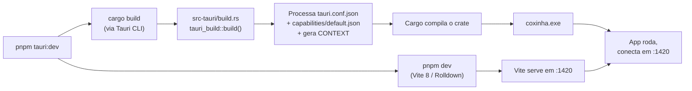
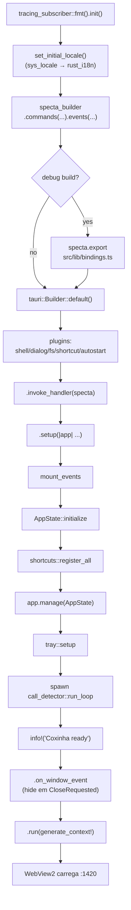
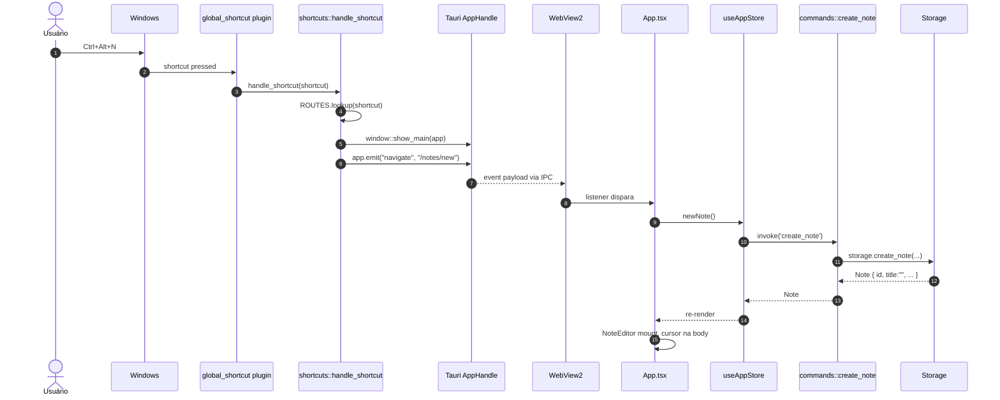
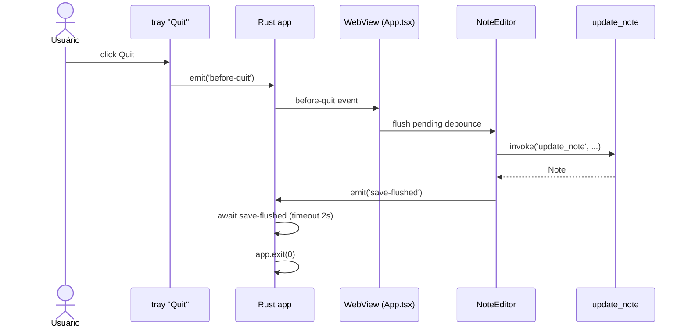

# Debugged helper — o que inicia quando

Guia de startup do Coxinha, em ordem cronológica. Serve pra
decidir **onde colocar um breakpoint** quando você está caçando um
bug de inicialização e pra entender a relação Rust ↔ TypeScript.

Três processos/fases rodam:

- **Build-time** (cargo + vite) — `build.rs`, `generate_context!`,
  codegen de bindings. Tudo **antes** do binário existir.
- **Host nativo** (Tauri/Rust) — o `coxinha.exe`. Dono do
  systray, atalhos globais, IPC, banco, filesystem.
- **WebView2** (frontend) — Edge Chromium embutido, roda o Vite
  dev server + React. Só fala com o host via IPC.

O fluxo **não** é sequencial no runtime: o Rust sobe primeiro, mas
o bundle do React é carregado pela WebView logo depois, e aí os
dois conversam por IPC. O diagrama principal deixa isso explícito
e o `sequenceDiagram` mostra um round-trip completo de exemplo.

---

## 1. Fase de build (cargo + vite)

Isso roda **antes** do `coxinha.exe` existir. Quando você faz
`pnpm tauri:dev`:

Pontos importantes:

- **`src-tauri/build.rs`** chama `tauri_build::build()`. Esse step
  é o que lê `tauri.conf.json`, compila os arquivos de
  `src-tauri/capabilities/*.json` em código Rust, e gera o
  `CONTEXT` que o macro `tauri::generate_context!()` expande
  dentro do `.run()` (veja `lib.rs:150`). Se `tauri.conf.json`
  estiver malformado, o erro aparece **aqui**, com mensagem do
  `tauri-build`.
- **Vite** (configurado em `vite.config.ts`) sobe em paralelo.
  Porta `1420`. Em dev, serve módulos ES direto (sem bundle);
  em build, usa Rolldown (Vite 8).
- **Bindings TS (`src/lib/bindings.ts`)**: hoje esse arquivo é
  regenerado **no startup do app** via `specta_builder.export()`
  (lib.rs:90). Isso é **pouco idiomático** — o canonical é
  mover para `build.rs`. Veja a [seção de debug traps](#5-debug-traps) no final.

---

## 2. Host (Rust/Tauri) — ordem de execução no runtime

### 2.1 `main()` — `src-tauri/src/main.rs`

Linha única: chama `coxinha_lib::run()`. O atributo
`windows_subsystem = "windows"` (só em release) esconde o console
— mas em debug ele aparece, que é onde você vê os logs do
`tracing`.

### 2.2 `run()` — `src-tauri/src/lib.rs:41`

Em ordem, com refs pro código:

1. **`tracing_subscriber::fmt().init()`** (`lib.rs:42-47`) — log
   subscriber global. `RUST_LOG=coxinha=trace` controla
   verbosidade.
2. **`set_initial_locale()`** (`lib.rs:49`, impl em `lib.rs:157`)
   — precisa ocorrer **antes** do tray porque `tray::setup` usa
   `t!(...)`.
3. **Specta builder** (`lib.rs:53-82`) declara commands + eventos
   tipados. Em debug, exporta `bindings.ts` no disco
   (`lib.rs:89-97`).
4. **`tauri::Builder`** (`lib.rs:99`): plugins → invoke handler →
   `.setup` closure.
5. **`.setup(|app|)`** (`lib.rs:114-141`) — dentro, em ordem:
   - `mount_events(app)` conecta os eventos tipados do specta
   - **`AppState::initialize`** (`config.rs:42`): carrega/cria
     `config.toml`, bootstrap de pastas, `Db::open` +
     migrations, `Storage::new`, `Recorder::new`, build dos
     engines. Primeiro ponto onde a inicialização pode falhar.
   - `shortcuts::register_all` com o config fresco — antes do
     `Arc<Mutex>` pra evitar `block_on`
   - `app.manage(shared_state)` — planta o state
   - `tray::setup` cria o TrayIcon
   - spawn do `call_detector::run_loop`
   - `info!("Coxinha ready")` — marco de boot completo
6. **`.run(...)`** (`lib.rs:150`): bloqueia na message pump do
   OS. **A janela nasce aqui** (escondida via `visible: false`
   no `tauri.conf.json`). WebView2 só começa a carregar agora.

### 2.3 Steady state

Depois do `.run()`, o Rust só reage a:

- **IPC** — um `invoke('xxx')` do frontend cai num command
- **Eventos externos** — `global_shortcut` dispara
  `shortcuts::handle_shortcut`
- **Loops spawnados** — `call_detector::run_loop` a cada 3s

---

## 3. WebView (TS/React) — ordem de execução

### 3.1 `index.html`

Carrega `/src/main.tsx` como `<script type="module">`.

### 3.2 `main.tsx` — `src/main.tsx`

1. `import './lib/i18n'` — side effect: i18next inicializa
   com `navigator.language`
2. `applyTheme(systemTheme())` — pinta o `.dark` class **antes**
   do React montar pra evitar flash do tema errado
3. `ReactDOM.createRoot(...).render(<StrictMode><App /></StrictMode>)`
   — em dev, effects rodam 2× por conta do StrictMode

### 3.3 `App.tsx` — ordem dos effects

1. Effect do tema — lê `localStorage` + planta listener de
   `matchMedia` se pref for 'auto', ouve
   `coxinha:theme-pref-changed`
2. Effect principal:
   - `loadNotes()` → **primeiro IPC** (`invoke('list_notes')`)
   - `listen('navigate')` → reage a atalho global / tray
   - `listen('call-detected')` → placeholder pra spec 0007

---

## 4. Sequência completa — exemplo: "New note" via atalho global

Pontos de breakpoint úteis nesse fluxo (mapeados aos números do
diagrama):

- **3** `shortcuts.rs:handle_shortcut` — verifica que o atalho
  foi recebido
- **4** `shortcuts.rs:ROUTES.lookup` — se não achar, é porque o
  `register_all` silenciou um conflict
- **9** `App.tsx` no listener — se não cair aqui, o backend não
  emitiu ou o `mount_events` não rodou
- **11** `commands::create_note` em `lib.rs` — fronteira IPC

---

## 5. Debug traps

Pegadinhas conhecidas que não são óbvias:

- **Capability esquecido.** Todo novo `#[tauri::command]` precisa
  estar autorizado em `src-tauri/capabilities/default.json`. Se
  não estiver, `invoke(...)` devolve
  `{status:'error', error:'not allowed'}`. A mensagem não grita,
  é só olhar o console do DevTools.
- **`bindings.ts` race em dev.** Como `specta_builder.export()`
  escreve o arquivo no start do app (`lib.rs:90`), e o Vite
  watcha `src/`, rebuildar o Rust dispara HMR. Se isso acontecer
  no meio de um `invoke`, tipos podem ficar temporariamente
  stale. Solução: mover a export pra `build.rs` (ver roadmap).
- **`emit('navigate', ...)` untyped ao lado de eventos tipados.**
  `navigate` é string-keyed (`tray.rs:33-37`,
  `shortcuts.rs:emit`) enquanto `CallDetected` é `#[derive(Event)]`.
  Inconsistência na fronteira — metade safe, metade não. Trocar
  typo no nome do evento silenciosamente passa por typecheck.
- **`Arc<Mutex<AppState>>` único serializa commands.**
  `search_notes` bloqueia `get_config` porque ambos pegam o lock
  do `AppState` inteiro. Não é bug, mas pode aparecer como
  latência em ações que deveriam ser paralelas (ex.: salvar
  nota enquanto sidebar refaz busca).
- **`AppState::initialize` é síncrono.** Lê `config.toml` e abre
  SQLite no thread do setup da Tauri. Funciona no F1 mas trava o
  boot em vaults grandes.
- **StrictMode roda effects 2× em dev.** Se `loadNotes` aparece
  no log duas vezes, não é bug — é design pra detectar effects
  não idempotentes. Em produção só roda uma vez.
- **Tray sem ícone explode.** `tray::setup` chama
  `app.default_window_icon().unwrap()`. Se o build não tiver
  ícone (spec 0017), panic no boot.

---

## 6. Graceful shutdown (ainda não implementado)

Quando o usuário clica `Quit` na tray (`tray.rs:39-41`), hoje o
código chama direto `app.exit(0)`. Consequência: saves pendentes
no editor (debounce de 500ms em `NoteEditor.tsx`) podem **perder
os últimos ~500ms de digitação** se o quit acontecer durante a
janela.

A implementação correta é:

---

## 7. Onde colocar breakpoints (receitas)

| Sintoma | Breakpoint sugerido |
|---------|---------------------|
| App nem abre | `lib.rs:114` (entrada do `.setup`) |
| Janela abre em branco | `App.tsx` useEffect principal; Network no DevTools |
| "Coxinha ready" nunca aparece | `config.rs:42` (`AppState::initialize`) |
| Atalho global não funciona | `shortcuts.rs:handle_shortcut`; se nem entra, é o `register_all` |
| Tray não aparece | `tray.rs:setup`, em particular `app.default_window_icon().unwrap()` |
| `invoke` retorna `not allowed` | checar `capabilities/default.json` |
| Command retorna erro mas UI fica muda | `lib.rs mod commands` fn correspondente; lembrar que `Result<T, String>` vira `{status:'error', error}` |
| `bindings.ts` fora de data | não é bug — é regenerado no start do Rust em debug |
| React re-renderiza 2× | é StrictMode em dev, espera-se |

---

## 8. Fronteira IPC — detalhes que importam

- **Tipos vêm do Rust.** `shared/src/lib.rs` tem os
  `#[derive(Type)]`; specta gera `src/lib/bindings.ts`. Nunca
  edite à mão.
- **Commands retornam `Result<T, E>`.** Frontend recebe
  `{status:'ok', data: T}` ou `{status:'error', error: E}`.
- **Eventos são broadcast** por padrão. Pra direcionar use
  `emit_to(window_label, name, payload)`.
- **State é `Arc<Mutex<AppState>>`**. Lock por
  `state.lock().await`. Modernização planejada: quebrar em
  múltiplos managed states (ver roadmap abaixo).

---

## 9. Roadmap de modernização

Listados aqui pra referência futura (cada um é spec / PR próprio):

- **Multi-state managed** — quebrar o `Arc<Mutex<AppState>>` em
  `Arc<Db>`, `Arc<Storage>`, `Arc<RwLock<AppConfig>>`, etc.
  Elimina contenção de mutex entre commands independentes.
- **`specta_builder.export()` em `build.rs`** — mover o codegen
  de bindings pra fase de build. Elimina a race com HMR do Vite.
- **Async setup** — `AppState::initialize` async via
  `tauri::async_runtime::block_on` dentro do `.setup`. Permite
  inicializações que precisam de await (ex.: Whisper model
  download).
- **`Navigate` tipado** — substituir `emit('navigate', string)`
  por `#[derive(Event)] Navigate { route: Route }` onde `Route`
  é enum. Consolida a fronteira IPC num só padrão.
- **Graceful shutdown** — flux diagramado na seção 6.
- **Suspense no `NoteEditor`** — trocar `initialMarkdown === null`
  por `use(promise)` + Suspense boundary. Elimina o loading
  skeleton síncrono, aproveita React 19.
- **i18n fluent-rs/icu** — quando BCP-47 region variants e
  pluralization forem restrição real (F2+).
