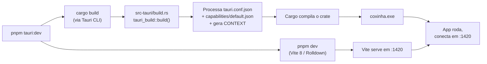
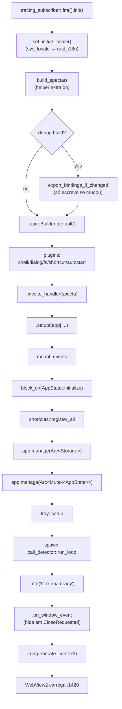
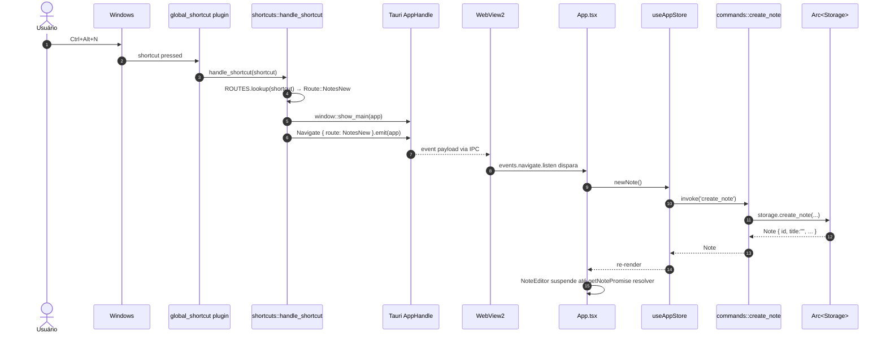
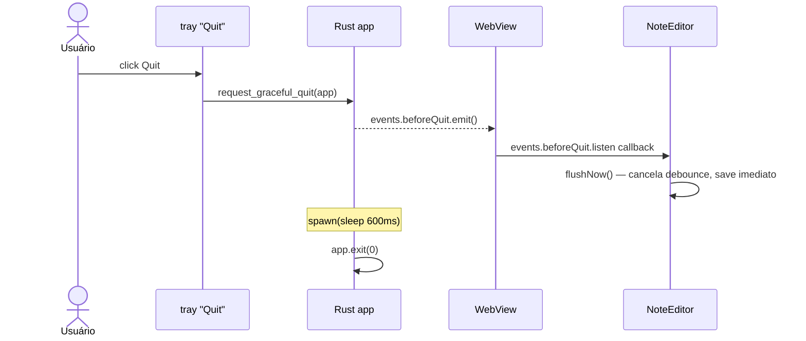

# Debugged helper — o que inicia quando

Guia de startup do Coxinha, em ordem cronológica. Serve pra
decidir **onde colocar um breakpoint** quando você está caçando um
bug de inicialização e pra entender a relação Rust ↔ TypeScript.

Três processos/fases rodam:

- **Build-time** (cargo + vite) — `build.rs`, `generate_context!`,
  codegen de bindings. Tudo **antes** do binário existir.
- **Host nativo** (Tauri/Rust) — o `coxinha.exe`. Dono do
  systray, atalhos globais, IPC, banco, filesystem.
- **WebView2** (frontend) — Edge Chromium embutido, roda o Vite
  dev server + React. Só fala com o host via IPC.

O fluxo **não** é sequencial no runtime: o Rust sobe primeiro, mas
o bundle do React é carregado pela WebView logo depois, e aí os
dois conversam por IPC. O diagrama principal deixa isso explícito
e o `sequenceDiagram` mostra um round-trip completo de exemplo.

---

## 1. Fase de build (cargo + vite)

Isso roda **antes** do `coxinha.exe` existir. Quando você faz
`pnpm tauri:dev`:



Pontos importantes:

- **`src-tauri/build.rs`** chama `tauri_build::build()`. Esse step
  é o que lê `tauri.conf.json`, compila os arquivos de
  `src-tauri/capabilities/*.json` em código Rust, e gera o
  `CONTEXT` que o macro `tauri::generate_context!()` expande
  dentro do `.run()` (veja `lib.rs`). Se `tauri.conf.json`
  estiver malformado, o erro aparece **aqui**, com mensagem do
  `tauri-build`.
- **Vite 8** (configurado em `vite.config.ts`) sobe em paralelo.
  Porta `1420`. Em dev, serve módulos ES direto (sem bundle);
  em build, usa **Rolldown** (novo bundler) — ~3× mais rápido
  que o Vite 6/esbuild anterior.
- **Tailwind 4** via `@tailwindcss/vite` plugin (no `vite.config.ts`).
  Configuração mora em `src/index.css` usando `@import "tailwindcss"`
  + bloco `@theme { ... }` (CSS-first). Não há mais `tailwind.config.ts`.
- **Bindings TS (`src/lib/bindings.ts`)**: regenerado no startup do
  app via `export_bindings_if_changed()` em `lib.rs`. O check de
  diff garante que o arquivo só é tocado quando a superfície IPC
  muda de verdade — sem disparar HMR do Vite a toa. Ver a
  [seção de debug traps](#5-debug-traps).

---

## 2. Host (Rust/Tauri) — ordem de execução no runtime

### 2.1 `main()` — `src-tauri/src/main.rs`

Linha única: chama `coxinha_lib::run()`. O atributo
`windows_subsystem = "windows"` (só em release) esconde o console
— mas em debug ele aparece, que é onde você vê os logs do
`tracing`.

### 2.2 `run()` — `src-tauri/src/lib.rs`



Em ordem, com refs pro código:

1. **`tracing_subscriber::fmt().init()`** — log subscriber global.
   `RUST_LOG=coxinha=trace` controla verbosidade.
2. **`set_initial_locale()`** — precisa ocorrer **antes** do tray
   porque `tray::setup` usa `t!(...)`.
3. **`build_specta()`** (helper em `lib.rs`) declara commands +
   eventos tipados (`Navigate`, `BeforeQuit`, `CallDetected`,
   `RecordingProgress`, `TranscriptionProgress`).
4. **`export_bindings_if_changed`** (em debug): compara com o
   `bindings.ts` atual; se igual, não toca no arquivo. Elimina a
   race com HMR do Vite.
5. **`tauri::Builder`**: plugins → invoke handler → `.setup` closure.
6. **`.setup(|app|)`** — dentro, em ordem:
   - `mount_events(app)` conecta os eventos tipados
   - **`tauri::async_runtime::block_on(AppState::initialize(...))`**
     — a `initialize` agora é `async fn`. Hoje o corpo é síncrono
     (TOML read, SQLite open, engine builders), mas futuras
     init-async (download de modelos, checks de rede) entram aqui
     sem mudar a assinatura.
   - `shortcuts::register_all` com o config fresco
   - **`app.manage(state.storage.clone())`** — Storage vira seu
     próprio managed state (Arc). 14 commands de hot path
     (`list_notes`, `search_notes`, `get_note`, `update_note`,
     `list_tags`, etc.) consumem direto via
     `tauri::State<'_, Arc<Storage>>`, **sem passar pelo mutex
     global**.
   - `app.manage(Arc<Mutex<AppState>>)` — state completo; só
     commands que mexem em mais de um subsistema (recorder,
     transcriber, config) ainda pegam daqui.
   - `tray::setup` cria o TrayIcon
   - spawn do `call_detector::run_loop`
   - `info!("Coxinha ready")` — marco de boot completo
7. **`.run(...)`**: bloqueia na message pump do OS. **A janela
   nasce aqui** (escondida via `visible: false` no
   `tauri.conf.json`). WebView2 só começa a bootar agora.

### 2.3 Steady state

Depois do `.run()`, o Rust só reage a:

- **IPC** — um `invoke('xxx')` do frontend cai num command (hoje
  dividido entre dois managed states, ver seção 8)
- **Eventos externos** — `global_shortcut` dispara
  `shortcuts::handle_shortcut`, tray menu dispara handlers
- **Loops spawnados** — `call_detector::run_loop` a cada 3s

---

## 3. WebView (TS/React) — ordem de execução

### 3.1 `index.html`

Carrega `/src/main.tsx` como `<script type="module">`.

### 3.2 `main.tsx` — `src/main.tsx`

1. `import './lib/i18n'` — side effect: i18next 26 inicializa com
   `navigator.language`
2. `applyTheme(systemTheme())` — pinta o `.dark` class **antes**
   do React 19 montar pra evitar flash do tema errado
3. `ReactDOM.createRoot(...).render(<StrictMode><App /></StrictMode>)`
   — em dev, effects rodam 2× por conta do StrictMode

### 3.3 `App.tsx` — ordem dos effects

1. **Effect do tema** — lê `localStorage`, planta listener de
   `matchMedia` se pref for `'auto'`, ouve
   `coxinha:theme-pref-changed`.
2. **Effect principal**:
   - `loadNotes()` → **primeiro IPC** (`invoke('list_notes')`)
   - `events.navigate.listen(...)` → reage a atalho global / tray
     (payload tipado `Navigate { route: Route }`)
   - `events.callDetected.listen(...)` → placeholder pra spec 0007

### 3.4 `NoteEditor.tsx` — Suspense + `use()`

O editor **não tem** branch `initialMarkdown === null`. A versão
React 19 usa:

```tsx
function NoteEditor({ noteId }) {
  return (
    <Suspense fallback={<LoadingSkeleton />}>
      <NoteEditorContent noteId={noteId} />
    </Suspense>
  );
}

function NoteEditorContent({ noteId }) {
  const content = use(getNotePromise(noteId));
  // …renderiza sem branch de loading
}
```

O `use(promise)` do React 19 suspende até resolver. O
`getNotePromise(noteId)` usa um `Map` de cache em escopo de módulo
porque `use()` exige referência estável entre renders.

---

## 4. Sequência completa — exemplo: "New note" via atalho global



Pontos de breakpoint úteis:

- **3** `shortcuts.rs::handle_shortcut` — verifica que o atalho
  foi recebido
- **4** `shortcuts.rs` busca `Route` no `ROUTES` map (tipado,
  `Route` enum, não mais string)
- **9** `App.tsx` no `events.navigate.listen` — se não cair aqui,
  o backend não emitiu ou o `mount_events` não rodou
- **11** `commands::create_note` em `lib.rs` — nota: agora pega
  `tauri::State<'_, Arc<Storage>>`, sem `.lock().await`

---

## 5. Debug traps

Pegadinhas conhecidas que não são óbvias:

- **Capability esquecido.** Todo novo `#[tauri::command]` precisa
  estar autorizado em `src-tauri/capabilities/default.json`. Se
  não estiver, `invoke(...)` devolve
  `{status:'error', error:'not allowed'}`. A mensagem não grita,
  é só olhar o console do DevTools.
- **Novo evento tipado não aparece no frontend.** Eventos
  declarados com `#[derive(Event)]` precisam estar dentro do
  `collect_events![...]` em `build_specta()`. Frontend acessa via
  `events.xxx.listen(...)` — não existe se o tipo não foi
  registrado.
- **Novo managed state não injeta.** Depois de
  `app.manage(MeuTipo)`, o command precisa declarar
  `tauri::State<'_, MeuTipo>` na assinatura. Tauri resolve por
  tipo; se o tipo não foi manejado, erro em runtime com
  `state not found`.
- **Storage commands NÃO veem AppState.** O hot path usa
  `Arc<Storage>` direto. Se você adicionar um command que precisa
  de config/recorder/transcriber, pega o `Arc<Mutex<AppState>>`
  em vez do Storage.
- **StrictMode roda effects 2× em dev.** Se `loadNotes` aparece
  no log duas vezes, não é bug — é design pra detectar effects
  não idempotentes. Em produção só roda uma vez.
- **Tray sem ícone explode.** `tray::setup` chama
  `app.default_window_icon().unwrap()`. Se o build não tiver
  ícone (spec 0017), panic no boot.
- **Suspense fica "girando" pra sempre.** `NoteEditor` usa
  `use(getNotePromise(id))`. Se você chamar
  `getNotePromise(id)` **dentro** do componente em vez de via
  o cache módulo-level, toda re-render cria uma nova promise e o
  Suspense nunca resolve. Mantenha a fonte da promise estável
  (Map keyed by id).
- **~~bindings.ts race em dev.~~** Resolvido: o `run()` só escreve
  o arquivo se o conteúdo mudou (diff check em
  `export_bindings_if_changed`). HMR não dispara a toa.
- **~~emit('navigate') untyped.~~** Resolvido: migrou pra
  `Navigate { route: Route }` tipado em `events.rs` (Route é
  enum, Rust ↔ TS compartilham o mesmo conjunto).

---

## 6. Graceful shutdown

Implementado em `tray.rs::request_graceful_quit`. Fluxo:



**Timing.** `QUIT_GRACE = 600ms` em `tray.rs`: cobre os 500ms do
debounce do editor + ~100ms de IPC round-trip. Medido, não
chutado — antes disso o `app.exit(0)` cortava saves em voo.

**Para novos componentes.** Qualquer componente com trabalho
pendente (drafts futuros, forms, etc.) só precisa de um
`events.beforeQuit.listen(() => flushLocalState())` no mount.

---

## 7. Onde colocar breakpoints (receitas)

| Sintoma | Breakpoint sugerido |
|---------|---------------------|
| App nem abre | entrada do `.setup` em `lib.rs` |
| Janela abre em branco | `App.tsx` useEffect principal; Network no DevTools |
| "Coxinha ready" nunca aparece | `config.rs::AppState::initialize` |
| Atalho global não funciona | `shortcuts.rs::handle_shortcut`; se nem entra, é o `register_all` |
| Tray não aparece | `tray::setup`, em particular `app.default_window_icon().unwrap()` |
| `invoke` retorna `not allowed` | checar `capabilities/default.json` |
| `invoke` retorna `state not found` | faltou `app.manage(...)` pro tipo declarado no command |
| Command retorna erro mas UI fica muda | `lib.rs mod commands` fn correspondente; lembrar que `Result<T, String>` vira `{status:'error', error}` |
| Quit não persiste os últimos caracteres | `NoteEditor.tsx::flushNow` — confirmar que o listener de `events.beforeQuit` está plantado |
| Suspense do editor gira pra sempre | `NoteEditor.tsx::getNotePromise` — garantir que o Map cache não foi esvaziado dentro do render |
| `bindings.ts` fora de data | não é bug em dev; é regerado se mudou. Se não mudou, fica |
| React re-renderiza 2× | é StrictMode em dev, esperado |

---

## 8. Fronteira IPC — detalhes que importam

- **Tipos vêm do Rust.** `shared/src/lib.rs` tem os
  `#[derive(Type)]`; specta gera `src/lib/bindings.ts`. Nunca
  edite à mão (a menos que esteja rebase-resolvendo).
- **Commands retornam `Result<T, E>`.** Frontend recebe
  `{status:'ok', data: T}` ou `{status:'error', error: E}`.
- **Eventos são broadcast.** Usar `events.xxx.emit()` (do
  `tauri_specta::Event`) ou `Type.emit(app)`. Eventos tipados
  hoje: `Navigate`, `BeforeQuit`, `CallDetected`,
  `RecordingProgress`, `TranscriptionProgress`.
- **Managed state dividido por contenção.**
  - `Arc<Storage>` — 14 commands de nota/meeting/tag/backlink.
    Sem mutex; operações concorrentes de diferentes notas não
    se bloqueiam.
  - `Arc<Mutex<AppState>>` — commands que mexem em config,
    recorder, engines (`transcribe_meeting`, `start_recording`,
    `update_config`, etc.). Ainda serializam entre si; isso é
    intencional até o recorder ganhar seu próprio managed state
    (roadmap).

---

## 9. Roadmap de modernização

Itens **implementados** (não são mais roadmap, listados como
referência histórica):

- ✅ **Mermaid diagrams** (PR #14) — substituiu ASCII art
- ✅ **Typed Navigate event** (PR #15) — elimina emit por string
- ✅ **`build_specta()` + export-if-changed** (PR #16) — sem HMR race
- ✅ **Async `AppState::initialize`** (PR #17) — assinatura pronta
  pra `await`; corpo ainda sync
- ✅ **Graceful shutdown** (PR #18) — `BeforeQuit` + 600ms grace
- ✅ **Suspense + `use()` no NoteEditor** (PR #19) — React 19
- ✅ **Multi-state parcial: `Arc<Storage>` extraído** (PR #20) —
  14 commands saem do mutex global

Ainda pendentes:

- **Multi-state completo.** `config` vira
  `Arc<RwLock<AppConfig>>` (leituras paralelas, escritas
  exclusivas). `recorder` ganha seu próprio `Arc<Mutex<Recorder>>`.
  `transcriber`/`diarizer`/`summarizer` como `Arc<dyn ...>`
  managed. Quando o `AppState` ficar só com `active_calls`,
  promove pra `Arc<Mutex<Vec<ActiveCall>>>` e aposenta a struct.
- **Async real dentro de `AppState::initialize`.** Hoje é
  `async fn` com corpo sync. Quando o Whisper/pyannote downloader
  precisar de `await` pra baixar modelos no primeiro boot, entra
  aqui.
- **i18n fluent-rs/icu.** Quando BCP-47 region variants (`pt-BR`
  vs `pt-PT`) e pluralization forem restrição real (F2+).
- **Specta export em `build.rs` / `xtask`.** A versão atual
  (runtime + diff check) é suficiente, mas mover pra build-time é
  o ideal canônico. Não feito porque `build.rs` não pode importar
  do próprio crate (chicken-egg); solução requereria um binary
  target dedicado ou `xtask`.
