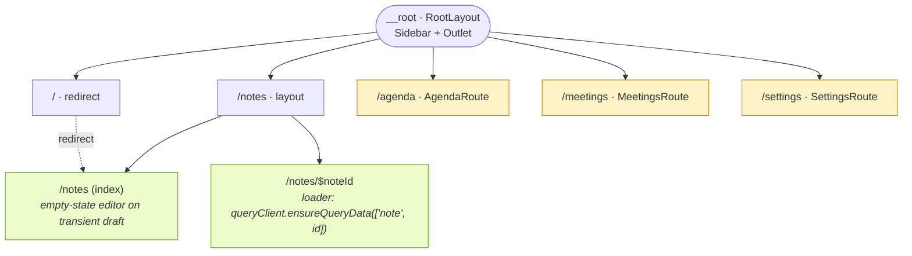
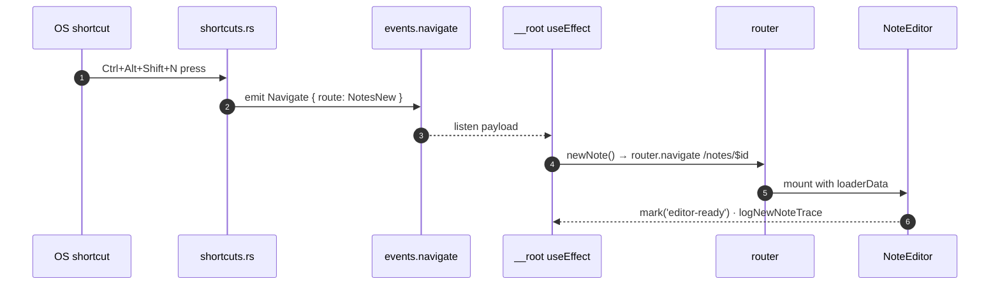

# Route tree

Open this file in VSCode and run the built-in Markdown preview
(Ctrl+Shift+V). Mermaid diagrams render inline.

## Who triggers what

## Notes

- Memory history on Tauri desktop; URL is internal (no address bar).
- `/` → redirect to `/notes` keeps the sidebar's Notes nav coherent
  with "the default view".
- `$noteId` loader pre-warms the React Query cache so the `NoteEditor`
  renders without a second IPC roundtrip.
- `AgendaRoute` / `MeetingsRoute` / `SettingsRoute` stay thin — they
  mount the feature component under `src/features/<domain>/`.
